<div align="center">



</div>

<br/>

<div align="center">
 <b>Connect with me</b>
</div>

<div align="center"><br/>

<a href="mailto:SEU_EMAIL@gmail.com"></a>
<a href="https://linkedin.com/in/SEU_LINKEDIN"></a>

</div>

<br/>

<div align="center">
 <b>Tech Stack</b>
</div>

<div align="center"><br/>


<br/>


</div>

<br/>

<div align="center">
 <b>GitHub Analytics</b>
</div>

<br/>

<div align="center">


<br/>


</div>

<br/>

<div align="center">
 <b>Pinned</b>
</div>

<br/>

<div align="center">


</div>

<br/>

<div align="center">

```
$ echo "obrigado pela visita"
```

</div>
